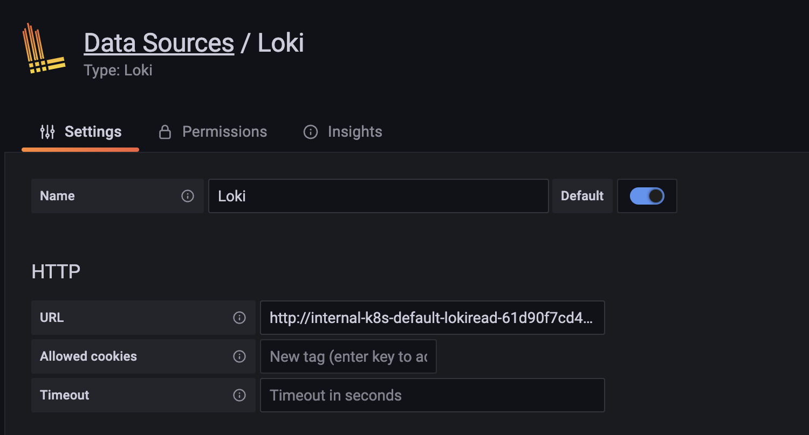

# Demo Work Through

This is a demo to show how to work with Grafana/Prometheus/Loki/X-Ray in AWS.

## Prerequisites

1. aws cli, terraform, kubectl, kubectx and helm installated properly.

   kubectl and helm are required for running terraform and kubectl is also used for demo applications installation.

2. Grafana AWS Identity Center SSO Configuration with at least one user available.

   UserID is required for configuring authorization via terraform run.

3. A valid and properly authorized user/role which has AccessKey/SecretKey or can assume temporary AccessKey/SecretKey

   Terraform used aws credential can be configured with aws cli profiles or enviroment values. Make sure the configured user/role has proper authorization.

## Demo Structure

```shell
├── demo-apps                    # the apps that generate logs and traces for demo purpose
│   ├── build.sh                 # build dockerfiles for both apps under `hello` and `world` directory
│   ├── hello                    # service hello in python Flask
│   ├── k8s-resources            # deployment and service definition for `hello` and `world`
│   └── world                    # service world in python Flask
├── demo.pptx                    # architecture of the demo
├── readme.md
├── screenshots
│   ├── kubectx.png
│   └── terraform run ok.png
└── tf                           # terraform coding
    ├── alb-controller.tf
    ├── aws.tf
    ├── collector                # ADOT collector
    ├── data_source.tf
    ├── karpenter.tf
    ├── observability            # module for creating observability relevent components
    ├── outputs.tf
    ├── provider.tf
    ├── provisioner              # karpenter provisioner
    ├── variables.tf
    └── versions.tf
```


## Deployment

### Infrastructure Deployment by Terraform

We will deploy the infrastructure with terraform IaC.


#### Configure Terraform

Adopt the provider and backend values below accoding to your own environment

```terraform
terraform {
  required_providers {
    aws = {
      source  = "hashicorp/aws"
      version = "~> 4.52.0"
    }
    kubernetes = {
      source = "hashicorp/kubernetes"
      version = "2.16.0"
    }
    helm = {
      source  = "hashicorp/helm"
      version = "~> 2.7.1"
    }
  }
 
  backend "s3" {
    bucket = "yagr-tf-state-log"
    key    = "tfc/observability/grafana-demo"
    region = "us-east-1"
  }
}
```

If the configuration works, you can run the commands below to verify

```
#!bin/bash

# initialize modules, backends, tfstate
terraform init
```


#### Deploy Infrastructure

In the `Observability` module, for loki deployment, I passed the AWS account AK/SK in the following manner.

```shell
#!/bin/sh

cat <<EOF
{
  "accessKeyId": "$GLOBAL_AWS_ACCESS_KEY_ID",
  "secretAccessKey": "$GLOBAL_AWS_SECRET_ACCESS_KEY"
}
EOF
```

Please make sure you have the correct environment values configured. 

Alternatively, you can also use serviceaccount with AWS IRSA for EKS to authorize loki service.

Terraform deployment commands as below.

```shell
#!bin/bash

# validate terraform grammar
terraform validate
# apply the terraform stack to AWS account
terraform apply --auto-approve
```

If everything works fine with your terraform code, you should see a output from console similar as screenshot below.


#### Update Local Environment

We need to configure local kubectl tool to deploy resources in the following sections. To configure kubectl, you could run the command below.

```shell
export KUBECONFIG=~/.kube/grafana-demo:~/.kube/config-demo:~/.kube/demo
export KUBECTX_IGNORE_FZF=1
aws eks update-kubeconfig --name grafana-demo  --kubeconfig ~/.kube/grafana-demo --region ap-southeast-1 --alias grafana-demo
kubectx grafana-demo
```

Now if you run `kubectx` you can see the `grafana-demo` context is highlighted and is used by kubectl cli.


### Cluster Configuration

Terraform Kubernetes provider is not able to apply CRD installation and CRD resources in the same run.

In the terraform code applied in the previous step, we have installed 2 components with CRD installation. AWS karpenter component for handling EKS cluster node auto-scaling and AWS OpenTelemetry Operator Controller Manager taking care of ADOT Collector generation. In this section, we will apply CRD resources to configure the 2 components.

#### Apply Karpenter Provisioner

```shell
# the file url used in the command below seats under tf directory
kubectl apply -f ./provisioner/provisioner.yaml
```

More information can be found here: https://karpenter.sh/

#### Apply ADOT Collector

```shell
# the file url used in the command below seats under tf directory
kubectl apply -f ./collector/collector.yaml
```

In the collector.yaml, we have configured several receivers, processors and exporters for metrics using prometheus and traces using x-ray.

- Prometheus:

  The prometheus receiver will scrape the jobs that defined in the collector.yaml and route the date to amazon managed prometheus by prometheusremotewrite exporter (batch/metrics processor will batch the metrics to make it exported accoring to timeout configured)

- X-Ray

  The otlp receiver will collect the OpenTelemetry formating tracing data and transform it into X-Ray compatible format by using xray exporter.

  At the same time, `metrics/otlp` will collect tracing related metrics data and send it to CloudWatch by using awsemf exporter. The metrics include many used data come alone with traces, e.g. request response time and error rates


#### Verify The Configuration

- Karpenter

  You can deploy a hello world application in EKS and configure the replica with a big number. The EKS cluster should be scaled automatically with the node type you defined in the provisioner.

- ADOT Collector

  As the jobs configured in collectors are already exporting data into Prometheus, you can verify the data from Grafana with a amazon managed prometheus data source.

  X-Ray data is still empty and we will proceed with application deployment to fill X-Ray data.

### Application Deployment

#### Push Docker Image

In the previously deployed terraform stack, we have created 2 docker image repo in AWS ECR service `grafana-demo-hello` and `grafana-demo-world`. Now we can push docker images built from our demo apps under `demo-apps` directory.

```shell
# this command will trigger the build scripts from each application direcoty.
sh ./build.sh
```

You need to update the scripts in both `hello` and `world` demo app directory to use correct ECR URL and aws profile.

```shell
# The commands below login to your AWS ECR docker repo, build the image and push it to the docker repo.
aws ecr get-login-password --region ap-southeast-1 | docker login --username AWS --password-stdin 613477150601.dkr.ecr.ap-southeast-1.amazonaws.com

docker build . -t grafana-demo-world:latest

docker tag grafana-demo-world:latest 613477150601.dkr.ecr.ap-southeast-1.amazonaws.com/grafana-demo-world:$DOCKER_IMAGE_VERSION

docker push 613477150601.dkr.ecr.ap-southeast-1.amazonaws.com/grafana-demo-world:$DOCKER_IMAGE_VERSION
```


#### Deploy Demo Apps

I have prepared a very simple deployment and service definition in `./demo-apps/k8s-resources` directory, and we can run the commands below to deploy it

```shell
kubectl apply -f ./demo-apps/k8s-resources/
```


## Verify Result

- Loki

  - Get Loki read URL for datasource

    ```
    $ kubectl get ingress
    NAME                CLASS   HOSTS   ADDRESS                                                                               PORTS   AGE
    loki-read-ingress   alb     *       internal-k8s-default-lokiread-61d90f7cd4-********.ap-southeast-1.elb.amazonaws.com   80      4d8h
    ```

  - Configure Datasource in Grafana

    

  - Explore the logs

  - Prometheus

    create data source in Grafana and Import 3119 Dashboard for data source prometheus

    

- X-Ray

  - Create data source and explore

    

### End

Viola! Viel Spass Leute~
