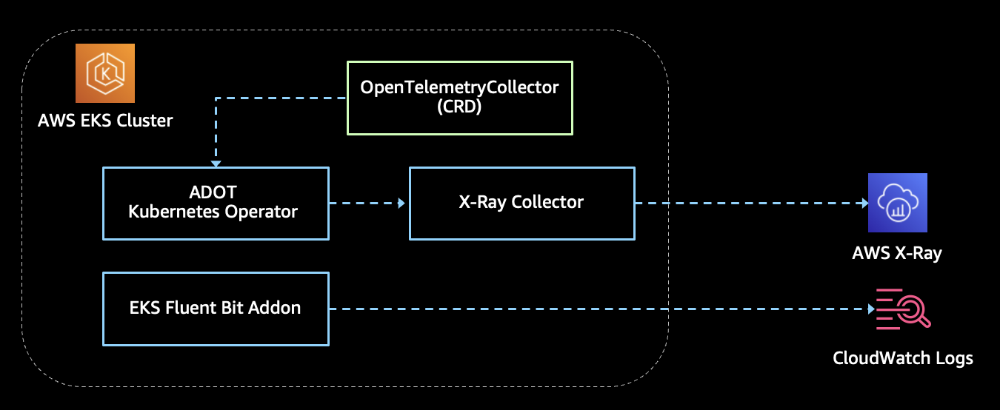

# X-Ray Demo

## Purpose

This is a simple demo for using x-ray with Java Agent and Cloud Watch Logs.
Logs will be collected by Fluent Bit daemonset in EKS.
X-Ray will propagate trace ID in log4j2 and will be collected by ADOT collector.

## Architecture Graph



## How to Run Through The Demo

### 1. Create EKS Cluster and Dependent Components via Terraform

- Open `tf` directory
- Follow the `readme.md` to prepare the EKS cluster with all dependent components

### 2. Create X-Ray Collector(s)

- Configure `kubectl` after EKS cluster is prepared

  ``` shell
  # for the demo, I used cmd "aws eks update-kubeconfig --name devax-demo  --kubeconfig ~/.kube/devax-demo --region ap-southeast-1 --alias devax-demo"
  aws eks update-kubeconfig --name [your-cluster-name]  --kubeconfig [your-kubeconfig-path] --region [your-configured-region] --alias [your-cluster-alias]
  ```

- Apply yaml files under collector directory

  ```shell
  kubectl apply ./collector
  ```

  

### 3. Deploy Demo Applications

Run the commands below to install sample applications in EKS cluster

```
cd sample-apps/hello
sh ./dockerbuild.sh v0.1
helm upgrade -i hello  ./helmchart

cd ../scg
sh ./dockerbuild.sh v0.1
helm upgrade -i scg  ./helmchart

cd ../world
sh ./dockerbuild.sh v0.1
helm upgrade -i world  ./helmchart
```

